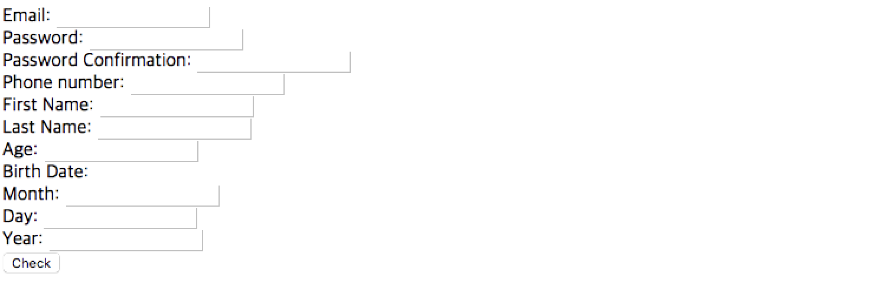
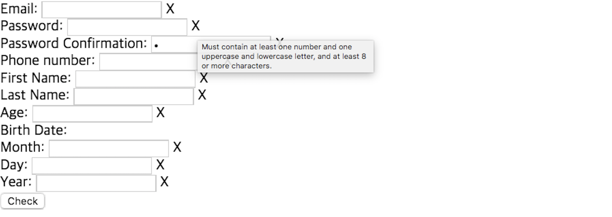

# Homework 1 - Python and JavaScript Basics

**Due: 9/15 (Sun) 18:00 (This is a hard deadline)**

This assignment is for you to become familiar with Python and JavaScript.
You will be using Python to build a backend system, and JavaScript to build a (separated) frontend system, using the React framework in hw2 and hw3.
This is an **individual** assignment.

From the beginning to the end of the development, you must use **GitHub** for version control.
This will be used for your submission as well, so please keep it in mind.

## Python

### Objective
In this assignment, you will implement an html file parser and find the common popular names for females and males in a year based on the skeleton code. 
You don't have to understand the implemented methods provided in the skeleton code, but studying them can be useful for your future term project.
This is a modification of google's [Baby Names Python Exercise](https://developers.google.com/edu/python/exercises/baby-names).

The goal of this assignment is to practice using various functions provided by the python language.
In this assignment, you will get familiar with:

  - Built-in functions
    - Python provides many useful built-in functions. You can write code more efficiently and effectively if you are fluent with such functions. 
  - Class
    - You will need to modularize and encapsulate your code to neatly manage your project. Class is a core concept to achieve such objectives. It is an important component in design patterns that you will learn in future classes.
    Since you will be defining your own models with classes in homework 3, you should be familiar with it.
  - Decorator
    - [Decorator](https://www.python.org/dev/peps/pep-0318/) is a special syntax in python for transforming functions using closure. It is also an important feature for applying design patterns in python, such as defining static methods or class methods.
    Many functions from Django are provided as decorators as well, especially with user authentication, which you will be using in homework 3.
  - Lambda function
    - Lambda function helps you write your python code in a functional programming style. In certain situations, functional style makes your code more concise and easy to modularize.
    For more information, read [Functional Programming HowTo](https://docs.python.org/3/howto/functional.html).

### 1. Implement `BabynameParser` 
You need to Implement the babyname parser class that parses the popular names and their ranks from an html file.
In your skeleton code, `BabyParser` class is defined in `babyname_parser.py`. To complete the parser, you should implement the following functions:

**1) `check_filename_existence`**

At first, you need to implement a decorator that checks whether the file exists or not.
This decorator will decorate the `__init__` of the parser to prevent constructing a parser with non-existing file name.
This method should be implemented as a decorator in order to be easily applied to other methods. 
Please check out [this document](https://www.programiz.com/python-programming/decorator) to understand how to implement python decorator.

For debuggability, defining your own exception and intentionally raising the exception is useful because you can identify the root cause of the exception and distinguish the exception from others.
We provide `BabynameFileNotFoundException` for this purpose. 
If there is no such file with the given filename argument of the function to decorate, this decorator has to raise the custom `BabynameFileNotFoundException` with custom error message: `No such babyname file or directory: {filename}`.
You can assueme that the `filename` argument is the first argument for the function to decorate.
Also, we will not grade your decorator with it's stack trace but just test the class of the raised exception and it's message.

For detailed information, check the execution example below.

**2) `__init__`**

This method is the constructor of the parser. In this method, you need to extract a list of the tuples of (rank, male-name, female-name) from the given html file. 
For your convinience, year extracting code is provided. You can refer the way to use regular expression in this code.

**3) `parse`**

This method applies a given lambda function to all of the extracted tuples and returns the results.

**Usage**

When you are done, you can parse any information about the popluar name ranks in a year by using the implemented parser. 
In the python console, you can test your code with the provided `baby1994.html` file like below.

```
>>> from babyname_parser import BabynameParser
>>> parser = BabynameParser("baby1994.html")
>>> parser.year
'1994'
>>> parser.rank_to_names_tuples
[('1', 'Michael', 'Jessica'), ('2', 'Christopher', 'Ashley'), ('3', 'Matthew', 'Emily'), ...]
>>> parser.parse(lambda rank_to_names_tuple: rank_to_names_tuple[0])
['1', '2', '3', '4', '5', '6', '7', '8', '9', '10', ...]
>>> BabynameParser("EmptyFileName")
Traceback (most recent call last):
  File "<input>", line 1, in <module>
  File "/{YOUR_HW_PATH}/babyname_parser.py", line {EXCEPTION_RAISED_LINE}, in {DECORATOR_WRAPPER_NAME}
    raise BabynameFileNotFoundException("No such babyname file or directory: {0}".format(filename))
babyname_parser.BabynameFileNotFoundException: No such babyname file or directory: EmptyFileName
```

You should **NOT** edit parts other than those marked as `TODO`s in your skeleton code when you submit your assignment, because we will grade your `BabynameParser` implementation by not only running `run.py` file but also importing the class and test the methods like above (with different files and lambdas, of course).
Also, the error message that comes out when the entered file does not exist must be 
`No such babyname file or directory: {filename}` and the result of `parse` method must be a list of all processed tuples.

### 2. Fill the run script

In `run.py` file, a skeleton code using the parser is provided.
Your task is to complete the code to parse an html file that contains the popular baby names in a year by using `BabynameParser`, sort them and find the common popular names with their rank.

When you are done, the script must show results like below for the given `baby1994.html` file:

```
$ python solution/run.py baby1994.html
Common popular babynames in 1994 (Count: 85)
Common babyname: male rank, female rank
Addison: 554, 800
Adrian: 98, 834
Alex: 50, 581
Alexis: 227, 18
Ali: 461, 674
Angel: 104, 176
Ariel: 480, 144
Ashley: 957, 2
...
```

## JavaScript

Each of the files serve the following roles:

- `form.html` : HTML file for layout for the form checking page.
- `form.js` : JavaScript file for form checking and using JS components.

We provide `form.html` completely so you don't need to modify the file, but it would be helpful to know the contents for following HWs and your term project.
You must only alter the code in the sections marked as TODO in the skeleton code and submit your code using GitHub. Do NOT alter the names of the forms in the provided HTML file. Refer to the HTML file to infer the form names.
Also, please follow the instructions below, such as message format, to enable us to automatize the grading. If not, your homework may not be graded properly.

TIP: You will find `console.log()` function useful for printing and debugging. You will be able to access the console by using the developer tools and JavaScript console provided in each of the different browsers.

### JavaScript Form Checker

To complete this assignment, you will have to implement a form checker, with tooltips, and modal pop-ups using JavaScript. Through this assignment, we expect you to be able to:

- See usages of JavaScript
- Try out basic and most common usages of JavaScript
- Some taste of JavaScript before diving into React with HW2.

When you open `form.html`, you will see the following screen on your browser.



In here, each input box receives user's input. There are labels right after every input box but they are not presented because they don't have contents yet.
If you push the "check" button, you will see an empty popup.

You need to provide following features by completing `form.js`:

**1) form validation popup**

With the given form, upon clicking on the `check` button, it should first produce a pop-up listing out which forms to check and correct (see requirements). 
If there is no problem with the form, it should show a modal indicating that it had been successfully submitted.
Specific **requirements** are as listed below.
- Email: characters other than @ or whitespace followed by an @ sign, followed by more characters (not '@', '.', or whitespace: co.kr is not allowed in this case), and then a ".". After the ".", you can only write 2 to 3 letters from a to z.
  - `characters(except for whitespace and '@')` **@** `characters(except for whitespace, '@' and '.')` **.** `2-3 alphabets` 
  - *characters* mean one or more characters including alphabets, numbers or special characters.
  - *alphabets* include both lowercase and uppercase.
  - e.g.) valid@javascript.com (O), invalid@snu.ac.kr (X)
- Password: Must contain at least one number and one uppercase and one lowercase letter, and at least 8 or more characters.
- Password Confirmation: Must match password.
- Phone number: nnn-nnnn-nnnn: three numbers, then "-", followed by four numbers and a "-", then four numbers.
- First name (English) : Start with a capital letter, followed by one or more lowercase letters. Should only contain alphabets (A-Z, a-z)
- Last name (English) : Start with a capital letter, followed by one or more lowercase letters. Should only contain alphabets (A-Z, a-z)
- Age : Must be a number between 0 and 200 (inclusive).
- Birth date (Month) : Must be one of "January", "February", ..., "December"
- Birth date (Day) : Must be a number of one or two digits.
- Birth date (Year) : Must be a number between 1800 and 2018 (inclusive).

If the form does not satisfy the requirements (for example, if Email, Password, and Password Confirmation fail), the alert message **must** be like:
```
You must correct: 

Email
Password
Password Confirmation
```
In here, the name of each entry of the validation failed input list must be identical with the name right after each `<br>` in the `form.html` like above.

If the form satisfies the requirements, the alert message **must** be:
```
Successfully Submitted!
```

**2) correct label and tooltip**

Even when closing the pop-up, it should tell once something is wrong with the form, with an 'X' icon next to each fields. Hovering the mouse over the icon should tell what is wrong with a tooltip like below. 



The error message in that tooltip **must** be identical with each requirement above.
Also, if an entry becomes valid after another check, the 'X' label have to be disappeared.

Tip: using regex might be useful for detecting wrong forms

## Grading

### Python (10 points)

We will test your code under Python 3.6.

- `check_filename_existence` decorator method in `babyname_parser.py` (2 points)
- `parse` method in `babyname_parser.py` (4 points) (automatically include the `__init__` constructor)
- `run.py` (4 points)
- Partial points for minor errors

### JavaScript (10 points)

We will grade the `form.js` and `form.html` file under the `javascript` directory in your GitHub repository. 
We will see the outputs to validate your answers.

- Valid form checking with proper alert message (5 points)
- Label (proper 'X') and modal tooltips (5 points)
- Partial points for minor errors


## Submission

Due: 9/15 (Sun) 18:00 (This is a hard deadline)

You must create your own *private* repository under your account ~~and **send them by email to `swpp-tas@spl.snu.ac.kr`**~~.
**Be sure to add the TAs as collaborators in your repository settings!** (Detailed instructions below).
We will check the snapshot of the *master* branch of your Github repository at the deadline and grade it.
Please create a `python` and `javascript` folders, and put your homework files in them appropriately. 
Because there are many students in this class, we need to automatize the grading process, so your homework may not be graded properly if your directory hierarchy doesn't look like this:
```
repository_root/
  README.md (this file)
  python/
    baby1994.html
    babyname_parser.py
    run.py
    ...
  javascript/
    form.html
    form.js
    ...
```
Also, make sure to push your work on Github on time.

### Instructions on creating a private repository

#### I. Get GitHub Student Developer Pack

1. Go to `https://education.github.com`.
2. Follow instructions to `Request a discount`.

#### II. Make your private repository

1. Go to your github profile: `https://github.com/YOUR_USERNAME`.
2. Under `Repositories`, click on `New`.
3. Fill in `swpp-hw1-USERNAME` as your repository name, and mark is as `Private`. (e.g., `swpp-hw1-ktaebum`)
4. Hit `Create repository`.
5. In terminal, go to the directory that you will be working in (e.g., `~/workspace/swpp-hw1-USERNAME` or `~/swpp-hw1-USERNAME`)
6. Type in and run the following commands, which is also shown on the page that you will be looking at after step 4:

```
echo "# asdf" >> README.md
git init
git add README.md
git commit -m "first commit"
git remote add origin https://github.com/USERNAME/swpp-hw1-USERNAME
git push -u origin master
```

Alternatively you can start by copying skeleton codes :)
```
cp -r ${swppfall2019-home}/hw1 ~/workspace/swpp-hw1-USERNAME
git init
git add .
git commit -m "first commit"
git remote add origin https://github.com/USERNAME/swpp-hw1-USERNAME
git push -u origin master
```

7. Under `Settings` then `Collaborators` tab, Add TAs as your collaborators: `ktaebum`, `kyunggeun-lee`, and `hy00nc`.
8. You're all set! After finishing your homework, push your contents to your repository on time!
